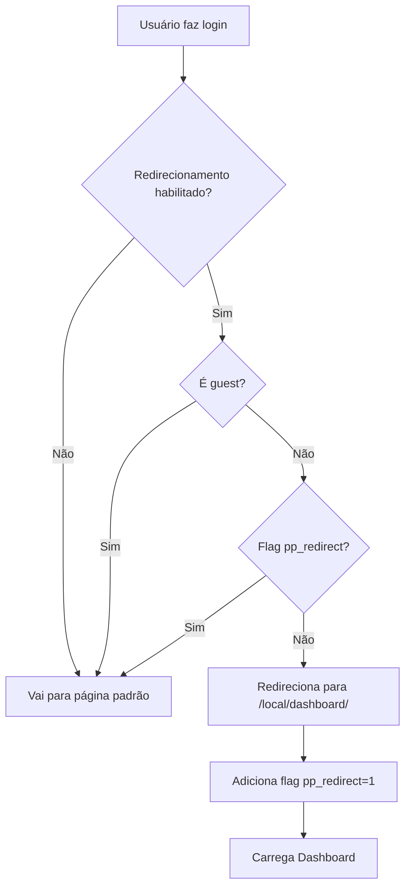
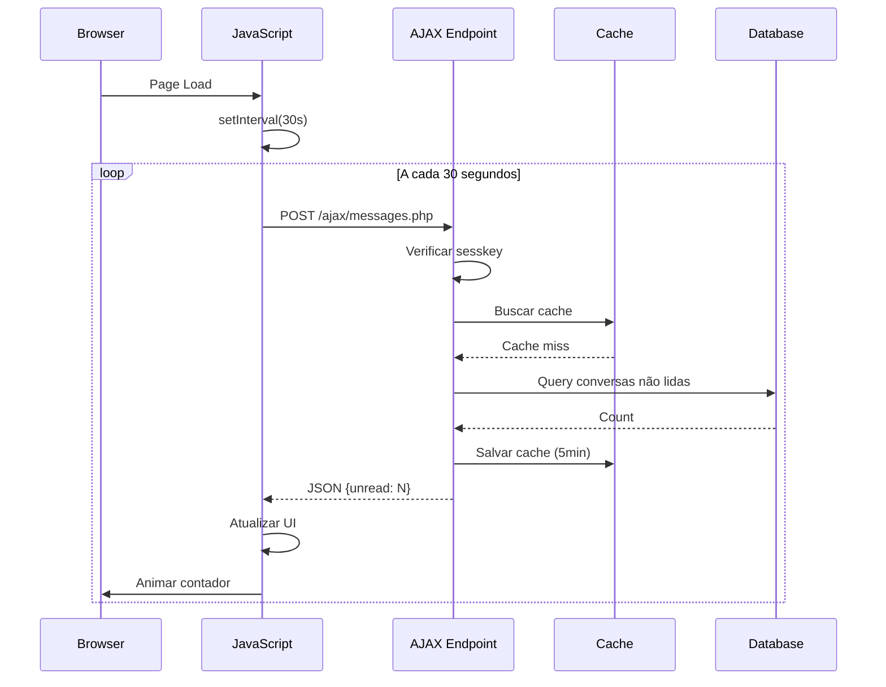
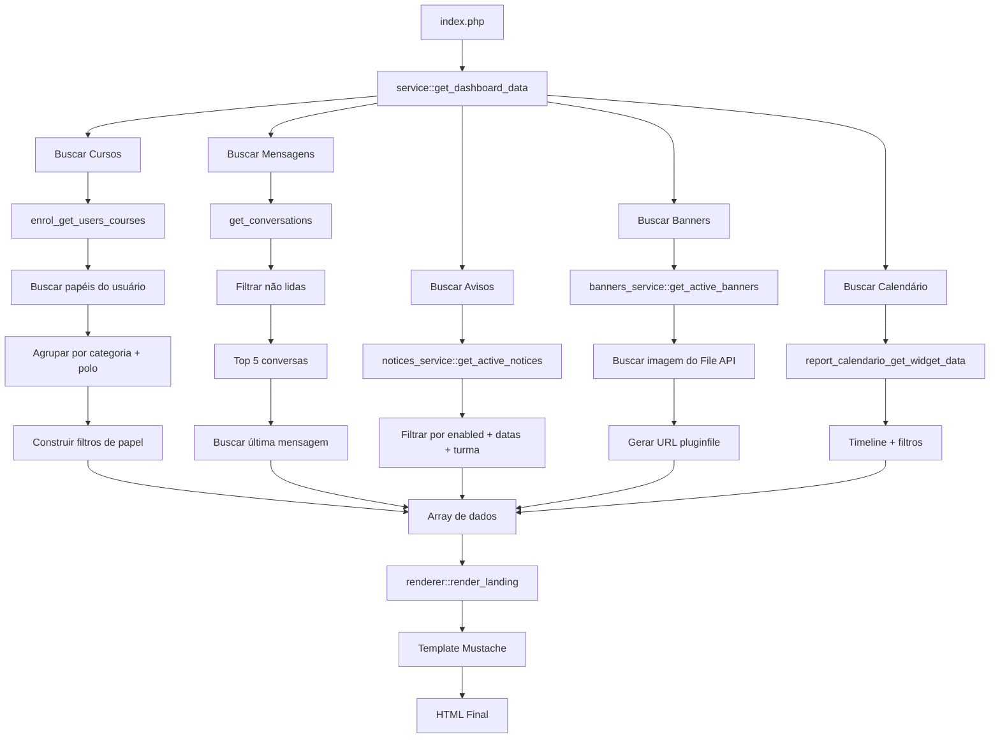

# Especificação Técnica - local_dashboard (Portal Acadêmico)

**Versão:** 2026062300  
**Data da Análise:** 23 de junho de 2026  
**Autor:** Análise de Código Automatizada  
**Compatibilidade:** Moodle 4.0+  
**Tipo:** Plugin Local (Local Plugin)

---

## 1. Visão Geral

### 1.1 Descrição do Plugin
**local_dashboard** é um plugin local para Moodle que cria um portal acadêmico centralizado, agregando informações importantes do estudante em uma única página. Funciona como um dashboard personalizado após o login, oferecendo visão 360° das atividades acadêmicas.

### 1.2 Problema que Resolve
- Fragmentação de informações em múltiplas páginas do Moodle
- Baixo engajamento inicial de estudantes com a plataforma
- Dificuldade em visualizar disciplinas, prazos e mensagens de forma unificada
- Necessidade de navegar por várias áreas para obter informações básicas
- Falta de visibilidade de comunicados importantes

### 1.3 Principais Características
- ✅ Dashboard unificado com 5 seções
- ✅ Redirecionamento automático após login (configurável)
- ✅ Sistema de mensagens não lidas com atualização automática
- ✅ Categorização de cursos por categoria e por polo
- ✅ Filtro de disciplinas por papel (role) do usuário
- ✅ Sistema de avisos dinâmicos com CRUD administrativo
- ✅ Widget de calendário acadêmico integrado (report_calendario)
- ✅ Sistema de banners com carrossel automático
- ✅ Cache otimizado para performance
- ✅ Design responsivo e moderno
- ✅ Suporte a múltiplos idiomas (PT-BR e EN)

---

## 2. Arquitetura do Sistema

### 2.1 Estrutura de Diretórios
```
local/dashboard/
├── version.php                    # Versão e metadados
├── lib.php                        # Funções de API (pluginfile)
├── index.php                      # Página principal do dashboard
├── settings.php                   # Configurações administrativas
├── styles.css                     # Estilos CSS
├── manage_notices.php             # CRUD de avisos dinâmicos
├── manage_banners.php             # CRUD de banners
├── README.md                      # Documentação básica
├── spec.md                        # Especificação técnica
├── LICENSE                        # Licença MIT
├── .gitignore                     # Controle de versão
├── ajax/
│   └── messages.php               # API AJAX para contador de mensagens
├── classes/
│   ├── observers.php              # Observadores de eventos
│   ├── local/
│   │   ├── service.php            # Lógica de negócio principal
│   │   ├── notices_service.php    # Serviço de avisos dinâmicos
│   │   └── banners_service.php    # Serviço de banners
│   └── output/
│       └── renderer.php           # Renderização de templates
├── db/
│   ├── install.xml                # Definição das tabelas
│   ├── upgrade.php                # Script de upgrade
│   ├── events.php                 # Registro de observadores
│   └── caches.php                 # Definições de cache
├── js/
│   └── message_counter.js         # Auto-refresh do contador
├── lang/
│   ├── en/
│   │   └── local_dashboard.php    # Strings em inglês
│   └── pt_br/
│       └── local_dashboard.php    # Strings em português
└── templates/
    └── landing.mustache           # Template principal
```

### 2.2 Componentes Principais

#### 2.2.1 Backend (PHP)
- **lib.php**: Função pluginfile para servir arquivos de banners
- **index.php**: Controller principal do dashboard
- **classes/local/service.php**: Lógica de coleta de dados (cursos, mensagens, calendário, avisos, banners)
- **classes/local/notices_service.php**: CRUD e lógica dos avisos dinâmicos
- **classes/local/banners_service.php**: CRUD e lógica dos banners com upload de imagem
- **classes/observers.php**: Observadores de eventos (login, mensagens)
- **ajax/messages.php**: Endpoint AJAX para contador de mensagens
- **manage_notices.php**: Página administrativa para gerenciar avisos
- **manage_banners.php**: Página administrativa para gerenciar banners

#### 2.2.2 Frontend (CSS + JavaScript)
- **styles.css**: Estilos otimizados (~200 linhas)
- **js/message_counter.js**: Auto-refresh a cada 30 segundos
- **templates/landing.mustache**: Template Mustache com JS embutido

#### 2.2.3 Sistema de Cache
- Cache de mensagens não lidas (5 minutos TTL)
- Invalidação automática em eventos de mensagens

---

## 3. Modelo de Dados

### 3.1 Tabelas Próprias
Este plugin possui **2 tabelas próprias** no banco de dados:

#### Tabela: `local_dashboard_notices`
| Campo | Tipo | Descrição |
|-------|------|-----------|
| id | INT(10) PK | ID único |
| title | VARCHAR(255) | Título do aviso |
| body | TEXT | Corpo do aviso (HTML) |
| type | VARCHAR(20) | Tipo: info, warning, danger, success |
| enabled | INT(1) | 1=ativo, 0=inativo |
| sortorder | INT(10) | Ordem de exibição |
| date_start | INT(10) | Início da exibição (timestamp, nulo=imediato) |
| date_end | INT(10) | Fim da exibição (timestamp, nulo=sempre) |
| turma | VARCHAR(10) | Turma alvo (2022, 2024, ou nulo=all) |
| timecreated | INT(10) | Timestamp de criação |
| timemodified | INT(10) | Timestamp de modificação |
| usermodified | INT(10) | ID do usuário que modificou |

#### Tabela: `local_dashboard_banners`
| Campo | Tipo | Descrição |
|-------|------|-----------|
| id | INT(10) PK | ID único |
| name | VARCHAR(255) | Nome interno do banner |
| alt_text | VARCHAR(255) | Texto alternativo (acessibilidade) |
| link_url | VARCHAR(255) | URL de destino (opcional) |
| enabled | INT(1) | 1=ativo, 0=inativo |
| sortorder | INT(10) | Ordem de exibição |
| timecreated | INT(10) | Timestamp de criação |
| timemodified | INT(10) | Timestamp de modificação |
| usermodified | INT(10) | ID do usuário que modificou |

A imagem do banner é armazenada no Moodle File API (file area `banners`, itemid = id do banner).

### 3.2 Tabelas Nativas do Moodle Utilizadas
- `{user}` - Dados do usuário
- `{course}` - Lista de cursos
- `{course_categories}` - Categorias de cursos
- `{enrol}` - Matrículas dos estudantes
- `{message_conversations}` - Conversas de mensagens
- `{message_conversation_members}` - Membros de conversas
- `{messages}` - Mensagens individuais
- `{message_user_actions}` - Ações do usuário (lido/não lido)

### 3.3 Sistema de Cache

#### Cache: `unread_messages`
**Definição em `db/caches.php`:**

| Configuração | Valor |
|-------------|-------|
| mode | APPLICATION |
| simplekeys | true |
| simpledata | true |
| ttl | 300 segundos (5 minutos) |
| staticacceleration | true |
| staticaccelerationsize | 100 |

**Chave:** `user_{userid}`  
**Valor:** Número de conversas não lidas  
**Invalidação:** Eventos de mensagem enviada/visualizada

---

## 4. Funcionalidades Detalhadas

### 4.1 Dashboard Principal (index.php)

#### 4.1.1 Fluxo de Execução
1. **Autenticação**: `require_login()` - Garante usuário autenticado
2. **Contexto**: Define contexto do sistema
3. **Layout**: Usa layout `mydashboard`
4. **Coleta de Dados**: Chama `service::get_dashboard_data($USER)`
5. **Renderização**: Usa renderer + template Mustache
6. **JavaScript**: Inclui auto-refresh de mensagens

#### 4.1.2 Dados Coletados
```php
[
    'userfullname' => 'Nome Completo',
    'courses' => [...],              // Disciplinas por categoria
    'coursesempty' => false,
    'coursesbypolo' => [...],        // Disciplinas por polo
    'haspoloview' => false,
    'rolefilters' => [...],          // Filtros de papel
    'hasrolefilter' => false,
    'messages' => [...],             // Mensagens não lidas (top 5)
    'messagesempty' => false,
    'totalunreadconversations' => 3,
    'allmessagesurl' => '/message/index.php',
    'notices' => [...],              // Avisos dinâmicos ativos
    'hasnotices' => false,
    'noticesJson' => '[...]',        // JSON para JS dos avisos
    'banners' => [...],              // Banners ativos
    'hasbanners' => false,
    'bannersmorethanone' => false,
    'calendario' => [...],           // Dados do calendário acadêmico
    'hascalendario' => false,
    'mycoursesurl' => '/my/courses.php',
]
```

---

### 4.2 Seção: Avisos Dinâmicos (Notices)

#### 4.2.1 Funcionalidade
- Barra de avisos no topo do dashboard (ocupa largura total)
- Suporte a múltiplos avisos com navegação (anterior/próximo)
- Rotação automática a cada 6 segundos
- Pausa ao passar o mouse
- 4 tipos: info (azul), warning (amarelo), danger (vermelho), success (verde)
- Agendamento por data e filtro por turma do usuário
- Gerenciamento via página admin dedicada

#### 4.2.2 Tabela: `local_dashboard_notices`
Ver seção 3.1 para definição completa dos campos.

#### 4.2.3 Lógica de Coleta (notices_service.php)
```php
// 1. Buscar campo de perfil 'turma' do usuário
$userturma = $DB->get_field('user_info_data', 'data', [
    'userid' => $userid,
    'fieldid' => $field->id
]);

// 2. Query filtrando por enabled + datas + turma
$sql = "SELECT *
        FROM {local_dashboard_notices}
        WHERE enabled = 1
          AND (date_start IS NULL OR date_start <= :now)
          AND (date_end   IS NULL OR date_end   >= :now)
          AND (turma IS NULL OR turma = :turma OR FIND_IN_SET(:turma2, turma) > 0)
        ORDER BY sortorder ASC, id ASC";
```

#### 4.2.4 Template Context
```php
// notices_service::to_template_context()
[
    [
        'id'    => 1,
        'title' => 'Aviso importante',
        'body'  => '<p>Conteúdo HTML</p>',
        'type'  => 'warning',
        'icon'  => '⚠️',
    ],
    ...
]
```

#### 4.2.5 JavaScript de Navegação
```javascript
var AUTO_INTERVAL = 6000;  // 6 segundos entre avisos
// Navegação manual: ppNoticeNav(dir)
// Auto-play: ppNoticeToggleAuto()
// Pausa ao passar o mouse
```

---

### 4.3 Seção: Banners / Carrossel

#### 4.3.1 Funcionalidade
- Exibe banners em formato de imagem entre os avisos e as mensagens
- Carrossel automático com transição suave (5s entre slides)
- Indicadores (dots) e setas de navegação
- Pausa ao passar o mouse
- Suporte a links opcionais nos banners
- Se apenas 1 banner ativo → exibe imagem estática sem navegação
- Se 0 banners ativos → nada é exibido
- Gerenciamento via página admin com upload de imagem

#### 4.3.2 Tabela: `local_dashboard_banners`
Ver seção 3.1 para definição completa dos campos.

#### 4.3.3 Lógica de Coleta (banners_service.php)
```php
// Buscar banners ativos ordenados
$banners = $DB->get_records('local_dashboard_banners', ['enabled' => 1], 'sortorder ASC, id ASC');

// Para cada banner, gerar URL da imagem via pluginfile.php
foreach ($banners as $banner) {
    $files = $fs->get_area_files($syscontext->id, 'local_dashboard', 'banners', $banner->id, ...);
    if (!empty($files)) {
        $file = reset($files);
        $imageurl = $CFG->wwwroot . '/pluginfile.php/' . $syscontext->id
                  . '/local_dashboard/banners/' . $banner->id . '/' . $file->get_filename();
        $banners_ctx[] = [
            'id'       => $banner->id,
            'name'     => $banner->name,
            'alt_text' => $banner->alt_text ?: $banner->name,
            'link_url' => $banner->link_url ?? '',
            'has_link' => !empty($banner->link_url),
            'imageurl' => $imageurl,
        ];
    }
}
```

#### 4.3.4 Template (Mustache)
```mustache
{{#hasbanners}}
<section class="pp-card pp-card-banners">
  <div class="pp-banners-carousel" id="pp-banners-carousel">
    <div class="pp-banners-track" id="pp-banners-track">
      {{#banners}}
      <div class="pp-banner-slide">
        {{#has_link}}
        <a href="{{link_url}}" target="_blank" rel="noopener" class="pp-banner-link">
          
        </a>
        {{/has_link}}
        {{^has_link}}
        
        {{/has_link}}
      </div>
      {{/banners}}
    </div>
    {{#bannersmorethanone}}
    <button class="pp-carousel-btn pp-carousel-prev" ...>&#10094;</button>
    <button class="pp-carousel-btn pp-carousel-next" ...>&#10095;</button>
    <div class="pp-carousel-dots" id="pp-carousel-dots"></div>
    {{/bannersmorethanone}}
  </div>
</section>
{{/hasbanners}}
```

#### 4.3.5 JavaScript do Carrossel
```javascript
var AUTO_INTERVAL = 5000;  // 5 segundos entre slides

function goToSlide(idx) {
    track.style.transform = 'translateX(-' + (idx * 100) + '%)';
    // Atualizar dots ativos
}

function nextSlide() { goToSlide(current + 1); }
function prevSlide() { goToSlide(current - 1); }

// Auto-play com timer
// Pausa ao passar o mouse
// Setas e dots como controle
```

#### 4.3.6 Servindo Arquivos (lib.php)
```php
function local_dashboard_pluginfile($course, $cm, $context, $filearea, $args, $forcedownload, $options = []) {
    if ($context->contextlevel != CONTEXT_SYSTEM) return false;
    if ($filearea !== 'banners') return false;
    
    require_login();
    
    $itemid = array_shift($args);
    $filename = array_pop($args);
    $filepath = '/' . implode('/', $args) . '/';
    
    $fs = get_file_storage();
    $file = $fs->get_file($context->id, 'local_dashboard', $filearea, $itemid, $filepath, $filename);
    if (!$file) return false;
    
    send_stored_file($file, 86400, 0, $forcedownload, $options);
}
```

---

### 4.5 Card: Minhas Disciplinas

#### 4.5.1 Funcionalidade
- Exibe cursos ativos do usuário organizados por categoria
- Alternância entre visão por **Categoria** e visão por **Polo** (toggle)
- Filtro por papel (role) do usuário (ex: Professor, Tutor, Aluno)
- Badges de papel exibidos ao lado de cada disciplina
- Ordenação alfabética por categoria/polo

#### 4.5.2 Lógica de Coleta (service.php)
```php
// 1. Buscar cursos matriculados
$courses = enrol_get_users_courses($user->id, true, 'id,shortname,fullname,category');

// 2. Filtrar apenas visíveis
foreach ($courses as $c) {
    if (!$c->visible) continue;
    $visiblecourses[] = $c;
}

// 3. Carregar categorias em lote (evita N+1 queries)
$categoryids = array_unique(array_column($visiblecourses, 'category'));
$categoriesmap = $DB->get_records_sql("SELECT id, name, path FROM {course_categories} ...");

// 4. Extrair IDs de polo (2º elemento do path da categoria)
foreach ($categoriesmap as $cat) {
    $parts = explode('/', trim($cat->path, '/'));
    $polocatids[] = (int)$parts[1];
}

// 5. Buscar papéis do usuário em lote
$roleassignments = $DB->get_records_sql(
    "SELECT ra.*, r.name AS rolename, r.shortname, ctx.contextlevel, ctx.instanceid
     FROM {role_assignments} ra ..."
);

// 6. Agrupar por categoria e por polo
$coursesByCategory[$categoryName][] = $courseitem;
$coursesByPolo[$poloName][] = $courseitem;

// 7. Construir filtro de papéis
$rolefilters = [['roleshort' => 'student', 'rolename' => 'Aluno'], ...];
```

#### 4.5.3 Estrutura de Dados
```php
// courses (visão por categoria)
[
    [
        'categoryname' => 'Ciências Exatas',
        'coursecount' => 3,
        'courses' => [
            [
                'id' => 123,
                'fullname' => 'Cálculo I',
                'url' => '/course/view.php?id=123',
                'hasbadge' => true,
                'roles' => [['rolename' => 'Professor', 'roleshort' => 'teacher'], ...],
                'rolescsv' => 'teacher,student',
            ],
        ]
    ],
]

// rolefilters
[['roleshort' => 'student', 'rolename' => 'Aluno'], ...]
```

---

### 4.6 Card: Calendário Acadêmico

#### 4.6.1 Funcionalidade
- Widget integrado com o plugin `report_calendario`
- Exibe cronograma das disciplinas em formato de timeline
- Suporte a múltiplos semestres
- Filtros por semestre, disciplinas regulares e reofertas
- Tooltip com detalhes da disciplina ao passar o mouse
- Versão desktop (tabela) e mobile (cards)
- Links para calendário completo e gerenciamento

#### 4.6.2 Integração
```php
// Verificar se plugin report_calendario está instalado
$calendario_lib = $CFG->dirroot . '/report/calendario/lib.php';
if (file_exists($calendario_lib)) {
    require_once($calendario_lib);
    if (function_exists('report_calendario_get_widget_data')) {
        $calendario = report_calendario_get_widget_data($user->id, 0, true, true, $user_turma);
    }
}
```

#### 4.6.3 Estrutura de Dados
```php
[
    'hassemestres' => true,
    'semestres' => [
        [
            'id' => 1,
            'nome' => '2026.1',
            'cor_fundo' => '#1e40af',
            'cor_texto' => '#ffffff',
            'meses' => [['nome' => 'Jan', 'nome_completo' => 'Janeiro'], ...],
            'disciplinas' => [
                [
                    'nome' => 'Cálculo I',
                    'codigo' => 'CAL123',
                    'professor' => 'Dr. Silva',
                    'datainicio_fmt' => '10/02/2026',
                    'datafim_fmt' => '15/06/2026',
                    'cargahoraria' => 60,
                    'sala' => 'Sala 101',
                    'cor' => '#3b82f6',
                    'is_reoferta' => false,
                    'horario' => 'Seg 19:00-22:00',
                    'meses_timeline' => [
                        ['ativo' => true, 'pos_inicio' => 10, 'largura' => 45, ...],
                    ],
                ],
            ],
        ],
    ],
    'fullcalendarurl' => '/report/calendario/index.php',
    'manageurl' => '/report/calendario/manage.php',
    'canmanage' => false,
]
```

---

### 4.7 Redirecionamento Automático após Login

#### 4.7.1 Observador de Evento (observers.php)
```php
class observers {
    public static function on_login(\core\event\user_loggedin $event) {
        global $USER;
        
        // 1. Verificar se redirecionamento está habilitado
        $enabled = get_config('local_dashboard', 'enabledredirect');
        if (empty($enabled)) return;
        
        // 2. Verificar se não é guest
        if (isguestuser($USER)) return;
        
        // 3. Verificar flag (evitar loop)
        $flag = optional_param('pp_redirect', 0, PARAM_INT);
        if (!$flag) {
            $url = new \moodle_url('/local/dashboard/index.php', 
                ['pp_redirect' => 1]);
            redirect($url);
        }
    }
}
```

#### 4.7.2 Registro do Observador (db/events.php)
```php
$observers = [
    [
        'eventname' => '\core\event\user_loggedin',
        'callback'  => '\local_dashboard\observers::on_login',
        'priority'  => 9999
    ],
    [
        'eventname' => '\core\event\message_sent',
        'callback'  => '\local_dashboard\observers::on_message_sent',
        'priority'  => 500
    ],
    [
        'eventname' => '\core\event\message_viewed',
        'callback'  => '\local_dashboard\observers::on_message_viewed',
        'priority'  => 500
    ],
];
```

---

### 4.8 Sistema de Cache

#### 4.6.1 Definição (db/caches.php)
```php
$definitions = [
    'unread_messages' => [
        'mode' => cache_store::MODE_APPLICATION,
        'simplekeys' => true,
        'simpledata' => true,
        'ttl' => 300,  // 5 minutos
        'staticacceleration' => true,
        'staticaccelerationsize' => 100,
    ],
];
```

#### 4.6.2 Uso do Cache
```php
// Buscar do cache
$cache = \cache::make('local_dashboard', 'unread_messages');
$cached = $cache->get("user_{$userid}");

if ($cached !== false) {
    return $cached;  // Retorna do cache
}

// Calcular e salvar no cache
$count = count_unread_conversations($userid);
$cache->set("user_{$userid}", $count);
return $count;
```

#### 4.6.3 Invalidação de Cache
```php
// Observadores que limpam cache
public static function on_message_sent(\core\event\message_sent $event) {
    $cache = \cache::make('local_dashboard', 'unread_messages');
    $relateduserid = $event->relateduserid;
    if ($relateduserid) {
        $cache->delete("user_{$relateduserid}");
    }
}

public static function on_message_viewed(\core\event\message_viewed $event) {
    $cache = \cache::make('local_dashboard', 'unread_messages');
    $userid = $event->userid;
    if ($userid) {
        $cache->delete("user_{$userid}");
    }
}
```

---

## 5. Configurações Administrativas

### 5.1 Localização
As configurações do plugin estão distribuídas em **3 páginas** no menu `Administração → Plugins → Plugins locais`:

| Página | Descrição |
|--------|-----------|
| **Portal Acadêmico** | Configurações gerais (redirecionamento, suporte) |
| **Gerenciar Avisos** | CRUD de avisos dinâmicos |
| **Gerenciar Banners** | CRUD de banners com upload de imagem |

### 5.2 Opções de Configuração (settings.php)

#### 5.2.1 Redirecionamento
| Campo | Tipo | Descrição |
|-------|------|-----------|
| enabledredirect | checkbox | Redirecionar usuários após login |
| Padrão | ✅ Habilitado | Exclui guests |

#### 5.2.2 Suporte Técnico
| Campo | Tipo | Descrição |
|-------|------|-----------|
| supportname | text | Nome do suporte |
| supportemail | text | E-mail do suporte |
| supportphone | text | Telefone do suporte |
| supportwhatsapp | text | URL do WhatsApp |
| supporthelpdesk | text | URL do portal de helpdesk |
| supporthours | text | Horário de atendimento |

### 5.3 Gerenciamento de Avisos (manage_notices.php)
- Lista completa com reordenação drag-and-drop
- Adicionar/Editar com editor HTML rich text
- Tipos: Info, Warning, Danger, Success
- Agendamento por data (início/fim)
- Filtro por turma (2022, 2024, ou todas)
- Ativar/Desativar toggle
- Excluir com confirmação

### 5.4 Gerenciamento de Banners (manage_banners.php)
- Lista completa com reordenação drag-and-drop
- Adicionar/Editar com upload de imagem
- Formatos aceitos: JPG, PNG, GIF, WebP
- Texto alternativo para acessibilidade
- Link de destino opcional
- Preview da imagem atual
- Ativar/Desativar toggle
- Excluir com confirmação (remove arquivo + registro)

---

## 6. Interface e Design

### 6.1 Layout Responsivo

#### 6.1.1 Grid System
```css
.pp-grid {
    display: grid;
    grid-template-columns: 1fr;  /* Mobile-first */
    gap: 16px;
}

@media (max-width: 768px) {
    .pp-grid { grid-template-columns: 1fr; }
}
```

#### 6.1.2 Cards
```css
.pp-card {
    background: #fff;
    border-radius: 16px;
    padding: 16px;
    box-shadow: 0 10px 30px rgba(0,0,0,.05);
    border: 1px solid rgba(0,0,0,.04);
}
```

### 6.2 Componentes Visuais

#### 6.2.1 Header do Dashboard
```css
.pp-header h2 { margin: 0 0 .25rem 0; }
.pp-header p { color: #6b7280; }
```

#### 6.2.2 Categoria de Cursos
```css
.pp-category-title {
    background: #f3f4f6;
    border-left: 4px solid #3b82f6;
    padding: 8px 12px;
    border-radius: 8px;
}
```

#### 6.2.3 Mensagens
```css
.pp-message-unread {
    background: #ef4444;
    color: white;
    padding: 2px 6px;
    border-radius: 10px;
}
```

#### 6.2.4 Banners / Carrossel
```css
.pp-card-banners{grid-column:1/-1;padding:0;overflow:hidden;border-radius:16px;}
.pp-banners-carousel{position:relative;width:100%;overflow:hidden;background:#f9fafb;}
.pp-banners-track{display:flex;transition:transform 0.5s ease-in-out;}
.pp-banner-slide{min-width:100%;flex-shrink:0;}
.pp-banner-img{display:block;width:100%;height:auto;max-height:320px;object-fit:cover;}
.pp-carousel-btn{position:absolute;top:50%;transform:translateY(-50%);
  background:rgba(255,255,255,0.85);border-radius:50%;width:38px;height:38px;
  cursor:pointer;box-shadow:0 2px 6px rgba(0,0,0,0.12);opacity:0;transition:all 0.2s;}
.pp-banners-carousel:hover .pp-carousel-btn{opacity:1;}
.pp-carousel-dots{position:absolute;bottom:12px;left:50%;transform:translateX(-50%);
  display:flex;gap:8px;background:rgba(0,0,0,0.35);padding:6px 12px;border-radius:20px;
  opacity:0;transition:opacity 0.3s;}
.pp-banners-carousel:hover .pp-carousel-dots{opacity:1;}
.pp-carousel-dot{width:10px;height:10px;border-radius:50%;border:2px solid rgba(255,255,255,0.7);
  background:transparent;cursor:pointer;}
.pp-carousel-dot.active{background:#fff;border-color:#fff;transform:scale(1.2);}
```

---

## 7. Fluxos de Trabalho

### 7.1 Fluxo de Login com Redirecionamento



### 7.2 Fluxo de Atualização de Mensagens



### 7.3 Fluxo de Coleta de Dados



---

## 8. Segurança

### 8.1 Autenticação e Autorização
- ✅ `require_login()` em todas as páginas
- ✅ Verificação de `sesskey` em AJAX
- ✅ Verificação de contexto em pluginfile
- ✅ Exclusão de guests no redirecionamento

### 8.2 Validações
```php
// AJAX
confirm_sesskey($input['sesskey']);

// Pluginfile
if ($context->contextlevel != CONTEXT_SYSTEM) return false;
if (!in_array($filearea, $fileareas)) return false;
require_login();

// Query SQL
$DB->count_records_sql($sql, [$userid, $userid, $userid, $action]);
// Prepared statements previnem SQL injection
```

### 8.3 XSS Prevention
```php
// Strings
format_string($c->fullname);  // Sanitiza HTML

// HTML rico
format_text($fallback, FORMAT_HTML, [
    'context' => context_system::instance()
]);

// Template Mustache
{{fullname}}  // Escapado automaticamente
{{{fulltext}}}  // HTML não escapado (confiável)
```

### 8.4 Cache Security
- Cache em nível de aplicação (não compartilhado)
- Chaves específicas por usuário (`user_{userid}`)
- TTL de 5 minutos (dados sensíveis não ficam muito tempo)

---

## 9. Performance e Otimizações

### 9.1 Sistema de Cache
- **TTL**: 5 minutos para mensagens não lidas
- **Static Acceleration**: 100 itens em memória
- **Invalidação Inteligente**: Apenas quando necessário

### 9.2 Queries Otimizadas
```sql
-- Usa COUNT DISTINCT para eficiência
SELECT COUNT(DISTINCT mc.id) ...

-- Usa EXISTS para short-circuit
AND EXISTS (SELECT 1 FROM {messages} ...)
```

### 9.3 Frontend
- **CSS Otimizado**: Arquivo único com ~200 linhas
- **JavaScript Assíncrono**: Não bloqueia renderização
- **Lazy Loading**: Imagens de banner com `loading="lazy"`
- **Batch Requests**: Uma única requisição AJAX para atualizar mensagens

### 9.4 Limitações de Dados
- **Conversas**: Top 50, filtra para 5
- **Cursos**: Apenas visíveis
- **Mensagens**: Última por conversa
- **Banners**: Sem limite (ordenados por sortorder)

---

## 10. Internacionalização (i18n)

### 10.1 Idiomas Suportados
- 🇧🇷 Português Brasileiro (pt_br) - **Completo**
- 🇺🇸 Inglês (en) - **Completo**

### 10.2 Strings Principais

**Interface:**
- `pluginname` - Portal Acadêmico
- `welcome_title` - Bem-vindo(a)
- `welcome_sub` - Suas disciplinas, prazos e mensagens em um só lugar

**Cards:**
- `mycourses` - Minhas Disciplinas
- `messages` - Mensagens
- `calendario` - Calendário Acadêmico

**Avisos:**
- `notices_manage` - Gerenciar Avisos
- `notice_add` / `notice_edit` / `notice_saved` / `notice_deleted`
- `notice_type_info` / `warning` / `danger` / `success`

**Banners:**
- `banners_manage` - Gerenciar Banners
- `banner_add` / `banner_edit` / `banner_saved` / `banner_deleted`

**Configurações:**
- `enabledredirect` - Redirecionar usuários após o login
- `supportname` / `supportemail` / `supportphone` / etc.

### 10.3 Uso no Código
```php
// PHP
get_string('pluginname', 'local_dashboard');

// Mustache
{{#str}} welcome_title, local_dashboard {{/str}}
```

---

## 11. Instalação e Configuração

### 11.1 Requisitos
- **Moodle**: 4.0+ (2022041900)
- **PHP**: 8.0+
- **Navegadores**: Chrome 70+, Firefox 65+, Safari 12+, Edge 79+

### 11.2 Instalação

#### Via Interface (Recomendado)
1. `Administração → Plugins → Instalar plugins`
2. Upload do arquivo ZIP
3. Seguir assistente de instalação

#### Via FTP/SSH
```bash
cd /path/to/moodle/local/
unzip dashboard.zip
chmod -R 755 dashboard/
```

### 11.3 Configuração Pós-Instalação

#### 1. Redirecionamento
```
Administração → Plugins → Plugins locais → Portal Acadêmico
✅ Habilitar redirecionamento após login
```

#### 2. Gerenciar Avisos
```
Administração → Plugins → Plugins locais → Gerenciar Avisos
- Adicionar avisos com título, texto, tipo e agendamento
- Arrastar para reordenar
```

#### 3. Gerenciar Banners
```
Administração → Plugins → Plugins locais → Gerenciar Banners
- Adicionar banners com upload de imagem (JPG, PNG, GIF, WebP)
- Definir link opcional e texto alternativo
```

#### 4. Testar
```
1. Fazer logout
2. Fazer login novamente
3. Verificar redirecionamento
4. Verificar todas as seções do dashboard
```

---

## 12. Manutenção e Troubleshooting

### 12.1 Problemas Comuns

#### Mensagens não atualizam
**Solução:**
```bash
# Limpar cache
php admin/cli/purge_caches.php
```

#### Banners não aparecem
**Diagnóstico:**
1. Verificar se o banner está ativo em Gerenciar Banners
2. Verificar se a imagem foi enviada corretamente
3. Testar URL direta: `/pluginfile.php/1/local_dashboard/banners/{id}/imagem.jpg`

#### Redirecionamento não funciona
**Diagnóstico:**
1. Verificar Setting habilitado
2. Verificar observers registrados:
```bash
php admin/cli/uninstall_plugins.php --plugins=local_dashboard --run
php admin/cli/install_plugins.php
```

### 12.2 Debug

#### Habilitar Debug
```php
// config.php
$CFG->debug = (E_ALL | E_STRICT);
$CFG->debugdisplay = 1;
```

#### Logs Relevantes
```bash
tail -f /var/log/apache2/error.log
tail -f /var/log/nginx/error.log
```

#### Testar AJAX
```bash
curl -X POST http://moodle.local/local/dashboard/ajax/messages.php \
  -H "Content-Type: application/json" \
  -d '{"sesskey":"ABC123"}'
```

---

## 13. Estrutura de Template (Mustache)

### 13.1 Template Principal (landing.mustache) — Estrutura Atual

```mustache
<div class="pp-container">
  <!-- Header -->
  <div class="pp-header">
    <h2>{{#str}} welcome_title, local_dashboard {{/str}}, {{userfullname}} 👋</h2>
    <p>{{#str}} welcome_sub, local_dashboard {{/str}}</p>
  </div>

  <div class="pp-grid">
    <!-- Avisos Dinâmicos -->
    {{#hasnotices}}
    <div class="pp-notices pp-notices-{{notices.0.type}}" id="pp-notices-bar">
      <span class="pp-notices-icon">{{notices.0.icon}}</span>
      <div class="pp-notices-body">
        <div class="pp-notices-title">{{notices.0.title}}</div>
        {{#notices.0.body}}<p class="pp-notices-text">{{{notices.0.body}}}</p>{{/notices.0.body}}
      </div>
      <div class="pp-notices-nav">
        <span class="pp-notices-counter"></span>
        <button onclick="ppNoticeNav(-1)">&#8592;</button>
        <button onclick="ppNoticeToggleAuto()">⏸</button>
        <button onclick="ppNoticeNav(1)">&#8594;</button>
      </div>
    </div>
    {{/hasnotices}}

    <!-- Banners / Carrossel -->
    {{#hasbanners}}
    <section class="pp-card pp-card-banners">
      <div class="pp-banners-carousel">
        <div class="pp-banners-track">
          {{#banners}}
          <div class="pp-banner-slide">
            {{#has_link}}<a href="{{link_url}}"></a>{{/has_link}}
            {{^has_link}}{{/has_link}}
          </div>
          {{/banners}}
        </div>
        {{#bannersmorethanone}}
        <button class="pp-carousel-btn pp-carousel-prev">&#10094;</button>
        <button class="pp-carousel-btn pp-carousel-next">&#10095;</button>
        <div class="pp-carousel-dots"></div>
        {{/bannersmorethanone}}
      </div>
    </section>
    {{/hasbanners}}

    <!-- Mensagens -->
    <section class="pp-card pp-card-messages">...</section>

    <!-- Minhas Disciplinas -->
    <section class="pp-card">...</section>

    <!-- Calendário Acadêmico -->
    <section class="pp-card pp-card-calendario">...</section>
  </div>
</div>
```

### 13.2 Contexto de Dados
```php
[
    'userfullname' => 'João Silva',
    'courses' => [/* disciplinas por categoria com badges de papel */],
    'coursesempty' => false,
    'coursesbypolo' => [/* disciplinas por polo */],
    'haspoloview' => true,
    'rolefilters' => [['roleshort' => 'teacher', 'rolename' => 'Professor'], ...],
    'hasrolefilter' => true,
    'messages' => [
        [
            'id' => 100,
            'name' => 'Maria Silva',
            'lastmessage' => 'Olá! Como vai?',
            'sendername' => 'Maria: ',
            'timeago' => '2 horas atrás',
            'unread' => true,
            'unreadcount' => 3,
            'url' => '/message/index.php?convid=100'
        ]
    ],
    'messagesempty' => false,
    'totalunreadconversations' => 5,
    'allmessagesurl' => '/message/index.php',
    'notices' => [
        [
            'id' => 1,
            'title' => 'Aviso importante',
            'body' => '<p>Conteúdo HTML</p>',
            'type' => 'warning',
            'icon' => '⚠️',
        ]
    ],
    'hasnotices' => true,
    'noticesJson' => '[{"id":1,...}]',
    'banners' => [
        [
            'id' => 1,
            'name' => 'Promoção',
            'alt_text' => 'Banner de promoção',
            'link_url' => 'https://example.com',
            'has_link' => true,
            'imageurl' => '/pluginfile.php/1/local_dashboard/banners/1/imagem.jpg',
        ]
    ],
    'hasbanners' => true,
    'bannersmorethanone' => false,
    'calendario' => [/* dados do calendário acadêmico */],
    'hascalendario' => true,
    'mycoursesurl' => '/my/courses.php',
]
```

---

## 14. Extensibilidade

### 14.1 Adicionar Novos Cards

**1. Modificar `service.php`:**
```php
public static function get_dashboard_data(\stdClass $user): array {
    // ... código existente ...
    
    // Novo card: Notas recentes
    $grades = self::get_recent_grades($user->id);
    
    return [
        // ... dados existentes ...
        'grades' => $grades,
        'gradesempty' => empty($grades)
    ];
}

private static function get_recent_grades($userid) {
    global $DB;
    // Implementar lógica de busca de notas
    return [...];
}
```

### 14.2 Adicionar Novo Tipo de Conteúdo (Ex: Banners)

Para adicionar um novo tipo de conteúdo gerenciável (como banners ou avisos):

1. **Tabela**: Adicionar em `db/install.xml` e `db/upgrade.php`
2. **Service**: Criar `classes/local/{name}_service.php` com CRUD
3. **Manage page**: Criar `manage_{name}.php` com listagem e formulário
4. **Settings**: Registrar página admin externa em `settings.php`
5. **Service principal**: Adicionar coleta em `classes/local/service.php`
6. **Template**: Adicionar renderização em `templates/landing.mustache`
7. **Lang**: Adicionar strings em ambos os idiomas

**2. Modificar template `landing.mustache`:**
```mustache
<!-- Novo Card: Notas -->
<section class="pp-card">
  <h3>📊 Notas Recentes</h3>
  {{#grades}}
    <div class="pp-item">
      <span>{{coursename}}</span>
      <span>{{grade}}</span>
    </div>
  {{/grades}}
  {{#gradesempty}}
    <p class="pp-empty">Sem notas recentes</p>
  {{/gradesempty}}
</section>
```

**3. Adicionar strings em `lang/pt_br/local_dashboard.php`:**
```php
$string['recentgrades'] = 'Notas Recentes';
$string['nogrades'] = 'Sem notas recentes';
```

### 14.2 Adicionar Novos Observadores

**1. Criar observador em `classes/observers.php`:**
```php
public static function on_course_completed(\core\event\course_completed $event) {
    // Limpar cache ou executar ação
}
```

**2. Registrar em `db/events.php`:**
```php
$observers[] = [
    'eventname' => '\core\event\course_completed',
    'callback'  => '\local_dashboard\observers::on_course_completed',
    'priority'  => 500
];
```

---

## 15. Métricas e Analytics

### 15.1 Métricas do Sistema
- Número de acessos ao dashboard por dia
- Tempo médio de carregamento
- Taxa de cliques em cursos/mensagens
- Uso de banners (CTR)

### 15.2 Dados Disponíveis (Logs Moodle)
```sql
-- Acessos ao dashboard
SELECT COUNT(*) 
FROM {logstore_standard_log}
WHERE action = 'viewed'
  AND target = 'local_dashboard'
  AND timecreated > UNIX_TIMESTAMP(DATE_SUB(NOW(), INTERVAL 30 DAY));

-- Cliques em cursos
SELECT courseid, COUNT(*) as clicks
FROM {logstore_standard_log}
WHERE action = 'viewed'
  AND target = 'course'
  AND userid IN (SELECT DISTINCT userid FROM {logstore_standard_log} 
                 WHERE target = 'local_dashboard')
GROUP BY courseid
ORDER BY clicks DESC;
```

---

## 16. Roadmap e Melhorias Futuras

### 16.1 Curto Prazo
- [ ] Card de atividades pendentes com prazos
- [ ] Card de eventos do calendário
- [ ] Widget de progresso de curso
- [ ] Filtros de período (semana/mês)

### 16.2 Médio Prazo
- [ ] Personalização por papel (estudante/professor)
- [ ] Dashboard para professores (turmas, atividades)
- [ ] Gráficos de progresso
- [ ] Integração com gamification

### 16.3 Longo Prazo
- [ ] Machine Learning para recomendações
- [ ] PWA (Progressive Web App)
- [ ] Modo offline
- [ ] Widgets customizáveis

---

## 17. Comparação com Alternativas

### 17.1 vs. Dashboard Padrão do Moodle
| Recurso | Dashboard Padrão | local_dashboard |
|---------|------------------|-----------------|
| Cursos por categoria | ❌ | ✅ |
| Contador de mensagens | ✅ | ✅ + Auto-refresh |
| Anúncios personalizados | ⚠️ Limitado | ✅ HTML + Banners |
| Redirecionamento | ❌ | ✅ |
| Cache otimizado | ⚠️ Geral | ✅ Específico |
| Design moderno | ⚠️ Tema-dependente | ✅ Custom |

### 17.2 vs. Temas Premium
- **Custo**: Gratuito vs. Pago
- **Integração**: Plugin vs. Tema completo
- **Manutenção**: Independente vs. Acoplada
- **Flexibilidade**: Alta vs. Média

---

## 18. Licença e Créditos

### 18.1 Licença
**MIT License**
- Uso comercial permitido
- Modificação permitida
- Distribuição permitida
- Uso privado permitido

### 18.2 Tecnologias Utilizadas
- Moodle Core API
- Mustache Template Engine
- Vanilla JavaScript (sem dependências)
- CSS3 (Grid, Flexbox)
- Cache API (MUC)

---

## 19. Glossário

| Termo | Definição |
|-------|-----------|
| **Dashboard** | Painel centralizado de informações |
| **Card** | Seção/widget do dashboard |
| **Observer** | Classe que escuta eventos do Moodle |
| **Pluginfile** | Sistema de servir arquivos do Moodle |
| **Cache** | Armazenamento temporário para performance |
| **Mustache** | Engine de templates do Moodle |
| **AJAX** | Requisições assíncronas sem reload |
| **TTL** | Time To Live (tempo de vida do cache) |
| **Filearea** | Área de armazenamento de arquivos |
| **Context** | Escopo de permissões (sistema, curso, etc) |

---

## 20. FAQ

### Q: Por que mensagens não atualizam imediatamente?
**A:** Sistema usa cache de 5 minutos + auto-refresh de 30s. Cache é invalidado em envio/leitura de mensagem.

### Q: Posso adicionar mais de 4 banners?
**A:** Sim, mas requer modificação em `settings.php`, `service.php` e `lib.php`. Padrão é 4 para performance.

### Q: Funciona com temas personalizados?
**A:** Sim, CSS é independente do tema. Usa classes próprias (`.pp-*`).

### Q: Como desabilitar redirecionamento para admins?
**A:** Sistema já exclui guests. Para excluir admins, modificar `observers.php`:
```php
if (is_siteadmin($USER)) return;
```

### Q: Posso usar em Moodle 3.x?
**A:** Não oficialmente. Requer Moodle 4.0+ devido a APIs de mensagens.

---

## Apêndices

### A. Estrutura Completa de Arquivos
```
/var/www/html/moodle/local/dashboard/
├── version.php (6 linhas)
├── lib.php (56 linhas)
├── index.php (28 linhas)
├── settings.php (129 linhas)
├── styles.css (51 linhas - minificado)
├── README.md (73 linhas)
├── PLUGIN_REFERENCE.md (1492 linhas)
├── CHANGELOG.md (histórico)
├── LICENSE (MIT)
├── .gitignore
├── ajax/
│   └── messages.php (71 linhas)
├── classes/
│   ├── observers.php (58 linhas)
│   ├── local/
│   │   └── service.php (187 linhas)
│   └── output/
│       └── renderer.php (11 linhas)
├── db/
│   ├── events.php (20 linhas)
│   └── caches.php (14 linhas)
├── js/
│   └── message_counter.js (49 linhas)
├── lang/
│   ├── en/local_dashboard.php (54 strings)
│   └── pt_br/local_dashboard.php (54 strings)
└── templates/
    └── landing.mustache (71 linhas)
```

### B. Contagem de Linhas de Código
```
PHP:         ~550 linhas
JavaScript:   ~50 linhas
CSS:          ~50 linhas
Mustache:     ~70 linhas
Markdown:   ~1700 linhas (docs)
TOTAL:      ~2420 linhas
```

### C. APIs do Moodle Utilizadas
- `enrol_get_users_courses()` - Cursos do usuário
- `\core_message\api::get_conversations()` - Conversas
- `\core_message\api::get_conversation_members()` - Membros
- `\core_message\api::get_conversation_messages()` - Mensagens
- `get_file_storage()` - Sistema de arquivos
- `cache::make()` - Sistema de cache
- `format_text()` - Formatação HTML
- `format_string()` - Sanitização de texto
- `fullname()` - Nome completo do usuário
- `userdate()` - Formatação de data

---

## Considerações Finais

### Pontos Fortes
✅ Interface limpa e moderna  
✅ Performance otimizada com cache  
✅ Auto-refresh de mensagens  
✅ Organização por categorias  
✅ Sistema de banners flexível  
✅ Código bem estruturado  
✅ Documentação completa  
✅ Fácil manutenção  

### Pontos de Melhoria
⚠️ Falta de testes automatizados  
⚠️ Sem analytics integrado  
⚠️ Limitado a 4 banners (hardcoded)  
⚠️ Sem personalização por papel  
⚠️ Sem card de atividades pendentes  
⚠️ Sem suporte a widgets drag-and-drop  

### Estado Atual
**Maturity:** Estável  
**Production Ready:** ✅ Sim  
**Test Coverage:** 0%  
**Documentation:** 95%  

### Recomendações
1. Adicionar testes unitários (PHPUnit)
2. Implementar analytics de uso
3. Criar sistema de widgets modulares
4. Adicionar card de atividades pendentes
5. Implementar personalização por papel
6. Melhorar acessibilidade (WCAG 2.1)

---

**Fim da Especificação Técnica**

*Documento gerado automaticamente através de análise de código.*  
*Para mais informações, consulte README.md e PLUGIN_REFERENCE.md.*
